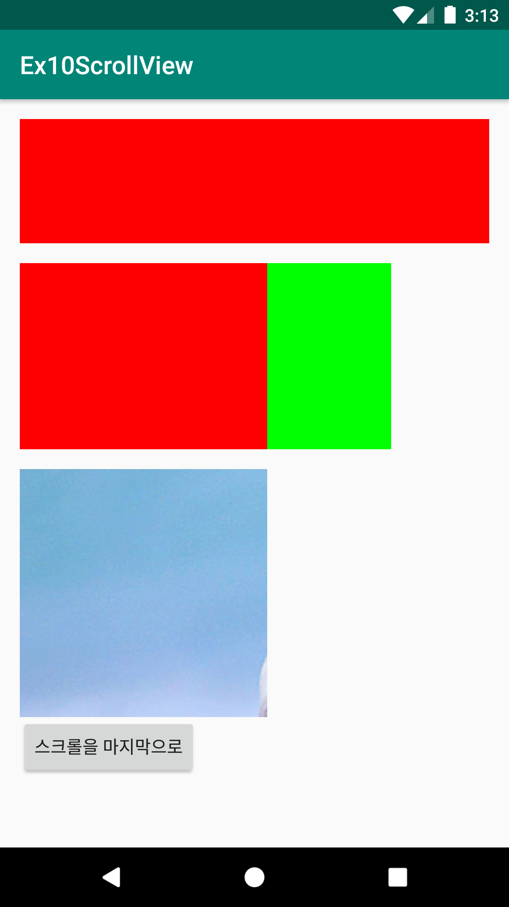
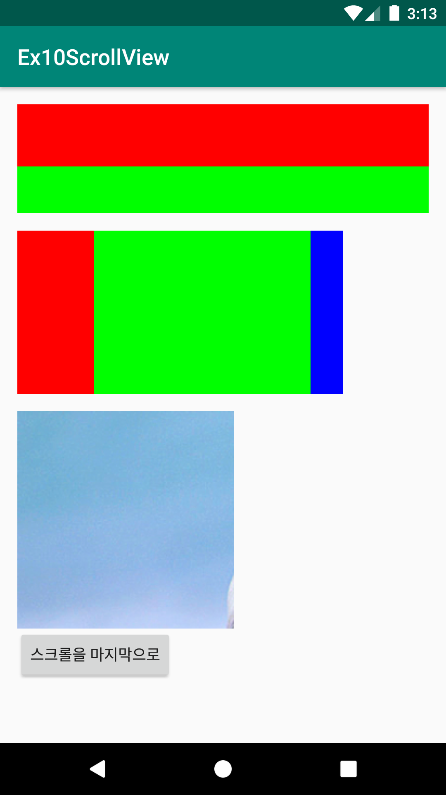
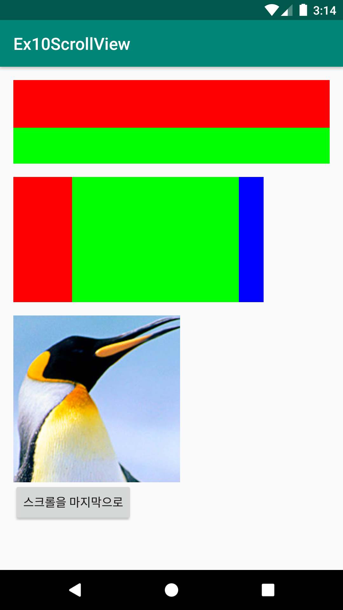
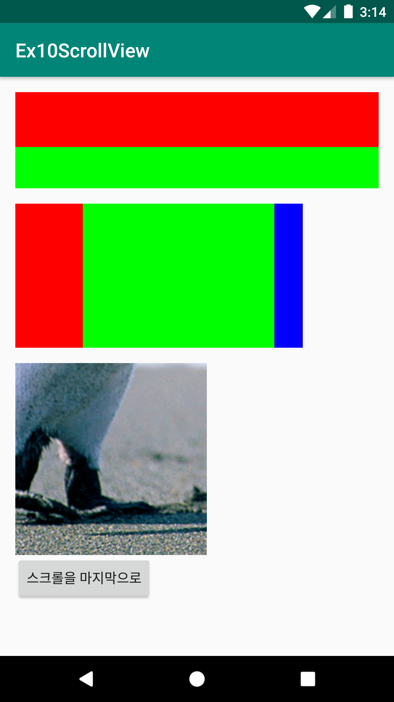

# Ex10ScrollView
안드로이드 네이티브 앱 개발 수업 예제#10

# 주요코드
ScrollView 알아보기

- res폴더>>layout폴더안에 있는 activity_main.xml문서를 수정하여 화면제작
- ScrollView는 기본적으로 세로방향을 스크롤 됨
- 스크롤뷰 안에는 오직 1개의 View만 추가가 가능함. 그래서 여러개를 추가하려면 안에 Layout같은 ViewGroup을 놓고 그 안에 View들을 추가해야함
- 스크롤뷰안에 있는 View의 height은 값을 어떻게 지정하던지 무조건 wrap_content로 됨
- 수평방향의 스크롤뷰는 별도의 클래스로 존재함 : HorizontalScrollView
- 수평, 수직 모두 스크롤되게 하려면 중첩스크롤 구조로 만들면 됨
- 스크롤뷰의 스크롤 위치를 Java코드를 통해 마지막으로 이동시키기 (버튼을 클릭하여 실행)

# 실행모습

  
  
  
  

# 실행모습 GIF

  

